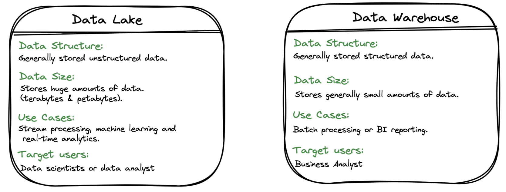
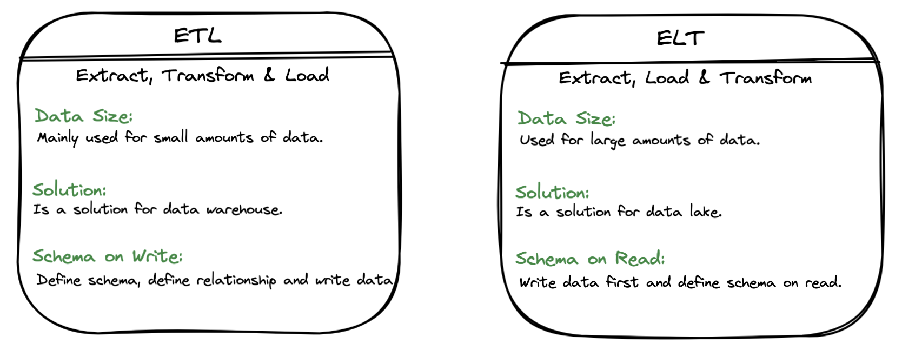
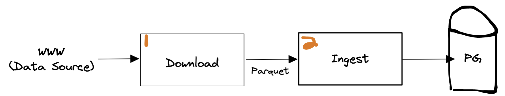
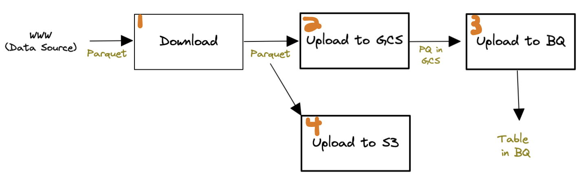
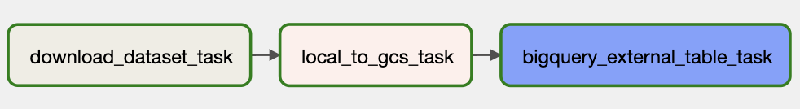
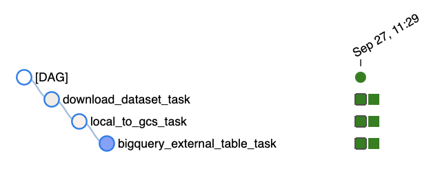
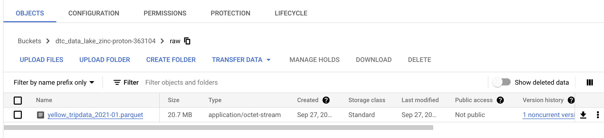
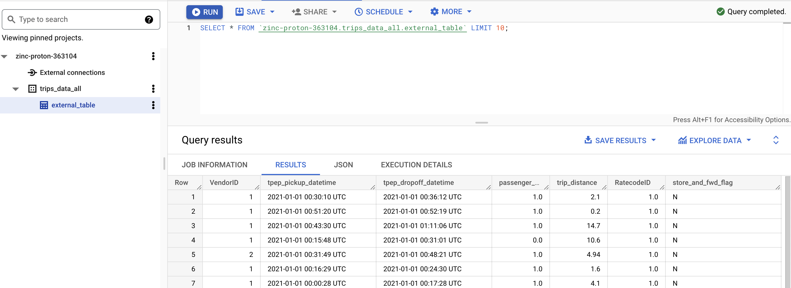
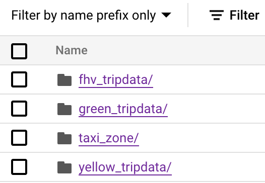
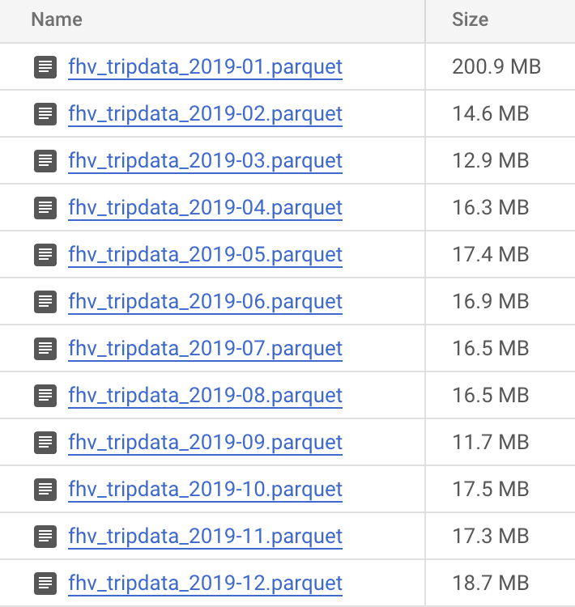

# Week 2 - Course Notes

This week's course will discuss about data ingestion, you can find the repo <a href="https://github.com/DataTalksClub/data-engineering-zoomcamp/tree/main/week_2_data_ingestion" target="_blank">here</a> and the accompanying course videos <a href="https://www.youtube.com/watch?v=W3Zm6rjOq70&list=PL3MmuxUbc_hJed7dXYoJw8DoCuVHhGEQb&index=17" target="_blank">here</a>.

This notes will cover:
- Data Lake
- Workflow Orchestration Concept
- Workflow Orchestration & Data Ingestion with Airflow
- Transfer Service
- Homework

## Data Lake
Data lake is a storage system that holds vast amounts of structured, semi-structured and unstructured data. The data lake solution generally has to be secure and able to capture and store raw data at scale, for a low cost.

The idea is to store and access the data as quicky as possible and make it useful to other team members without relying too much on the Devs team (develop structure and relationships of the data).

Difference between data lake and data warehouse:

Difference between ETL and ELT:

Data lake might become useless if:
- It converts to data swamp. This occurs when adequate data quality and data governance measures are not implemented, such as no versioning and incompatible schemas.
- There is no possibility to join different datasets, because there is no foreign keys available.

Cloud provider for data lake:
- <a href="https://cloud.google.com/storage" target="_blank">GCP - Cloud Storage</a>
- <a href="https://aws.amazon.com/s3/" target="_blank">AWS - S3</a>
- <a href="https://azure.microsoft.com/en-us/products/storage/blobs/" target="_blank">Azure - Azure Blob</a>

## Workflow Orchestration Concept

In previous week's lecture we completed a data ingestion <a href="https://github.com/Balurc/data_eng_zoomcamp/blob/main/week1_introduction/2_docker_sql/ingest_data.py">process/script</a> that downloads NYC LTC dataset (parquet) and store it out Postgres database. While this process is simple and able to deliver some results, but this is a less than ideal choice of data ingestion process. 

In the script we have 2 processes, one for downloading the data source and the other for inserting data. This is a good example of how we should not write our data pipelines. Imagine if your internet is suddenly unavilable, then your entire script will fail. 

Ideally, we should split the process into 2 scripts, one for downloading data and save it locally and the other for inserting data to database. For our previous data pipeline, it should look something like this:

In this week, we will work on a more complex data pipeline. We will have 4 steps from extracting data (parquet file) and save it local, to uploading it to our data lake (GSC) and copy it to data warehouse (BQ table). There is some dependencies between these steps, for example the 3rd step depends on the 2nd step as it expects that it already uploads data to GCS, hence we need to ensure that we execute these things in order (3rd step will be executed once 2nd step completed). Step 4 is an example of a job/task that can run pararelly that stores data to different cloud provider. 

This pipeline is what we call as data workflow, and sometimes we also refer it as DAG. The edges between the nodes (the rectangular things or our job) are dependencies, the data that we produce. The arrows represent the direction or execution order, so that we know which job depends on which one.

There are many tools that exist to do workflow orchestration, the most popular ones are as below. This course will use Airflow as the workflow orchestration tool.
- <a href="https://github.com/spotify/luigi">Luigi</a>
- <a href="https://github.com/apache/airflow">Airflow</a>
- <a href="https://github.com/PrefectHQ/prefect">Airflow</a>

## Workflow Orchestration & Data Ingestion with Airflow

### Workflow Architecture

An airflow installation generally consists of the following components:
- A web server, which is a GUI to inspect trigger and debug the behavior of DAGs and tasks. This is available on localhost `8080`.
- A scheduler, which is a component responsible to schedule jobs. A scheduler handles:
  - Triggering and scheduled workflows.
  - Submit tasks to the executor to run.
  - Monitor all tasks and DAGs.
  - Trigger the task instances (once depedencies are completed).
- A worker, which is component that executes the tasks given by the scheduler.
- Metadata database, which is the airflow back end environment used to store the state of the environmen (used by scheduler, executor and web server).
- Redis, which is a message broker that forwards messages from the scheduled to worker.
- Flower, which is an app to monitor environment on localhost `5555`.
- Airflow init service, to intitialize our configs such as the backend user credentials, environment variables, etc.

### Setup Airflow Environment with Docker

Please follow these steps:

Prerequisites:

1. Create a new folder named `credentials` in a folder called `.google` in your $HOME directory, rename your `gcp-service-accounts-credentials` file to `google_credentials.json` & store it that folder.

        cd ~ && mkdir -p ~/.google/credentials/
        mv <path/to/your/service-account-authkeys>.json ~/.google/credentials/google_credentials.json

2. Upgrade your docker-compose version to v2.x+ and and set the memory for your Docker Engine to minimum 5GB. You can check your docker-compose version with docker-compose --version.

Airflow Setup:

1. Go to your project directory and create a new folder called `airflow`.

2. Move to `airflow` directory and create 3 folders; `dags`, `logs` and `plugins`.
    - `dags` folder is where you store your airflow pipelines.
    - `logs` folder is to store all the logs related information or the commnunication between the scheduler and the workers.
    - `plugins` folder is to store any custom plugins or helper functions or utilities that you may need to use within your dags.
    
3. Store your `AIRFLOW_UID` in your `.env` file by running this command `echo -e "AIRFLOW_UID=$(id -u)" > .env`. Now if you open `.env` in the directory you can see your `AIRFLOW_UID`.

4. Next, download the official docker image provided by airflow with this command `curl -LfO 'https://airflow.apache.org/docs/apache-airflow/stable/docker-compose.yaml'`. Once you have your docker-compose.yaml downloaded, if you open the file, at first it can be very overwhelwing for you. But for this course, we can skip and focus on the main part, which is only web server.

5. Create a `Dockerfile`, pointing to airflow version `apache/airflow:2.2.3` as the base image. Then we need to do add some customizations to our `Dockerfile`.
    - Custom package to install `gcloud`to connect with the GCS bucket/Data Lake.
    - Integrate `requirements.txt` to install `apache-airflow-providers-google` and `pyarrow`.
    
6. In our `docker-compose.yaml` file;
    - Remove the `image` tag and replace it with:
      build:
      context: .
      dockerfile: ./Dockerfile
    - Add 4 new environment variables:
    
          GOOGLE_APPLICATION_CREDENTIALS: /.google/credentials/google_credentials.json (It is recommended to you the full path)
          AIRFLOW_CONN_GOOGLE_CLOUD_DEFAULT: 'google-cloud-platform://?extra__google_cloud_platform__key_path=/.google/credentials/google_credentials.json'
          GCP_PROJECT_ID: '<your_gcp_project_id>'
          GCP_GCS_BUCKET: '<your_bucket_id>'
    - Set `AIRFLOW__CORE__LOAD__EXAMPLES: False` to remove the default dags examples.
    - Add a volume and point is to the folder where you save your credential json file `~/.google/credentials/:/.google/credentials:ro`. It is recommended to you the full path.
    
7. Check here for the final version of Dockerfile and docker-compose.yaml file.

8. Next, let's first build the docker image with `docker-compose build`. At this stage if you experience this error: `error: failed to solve: failed to compute cache key: "/scripts" not found`, my solution is to create a new folder named `scripts` and re-run the command again. You only need to run `docker-compose build` again if there is any changes in Dockerfile.

9. Once we have built the image, we intialize the airflow services with `docker-compose up airflow-init`. Once ready, run `docker-compose up -d` to run our containers. After running the command, you can see the list of running containers with `docker-compose ps`.

10. If you have successfully run all the above steps, you can access the airflow GUI on `localhost:8080` with username and password: `airflow`. As mentioned in the course by the tutor, this is not a recommended setup for production.

11. To shut down the containers run: `docker-compose down`.

12. To stop and delete containers, delete volumes with database data and downloaded images, run: `docker-compose down --volumes --rmi all` or `docker-compose down --volumes --remove-orphans`.

### Lite Version Setup

We can see from previous steps that we have 7/8 containers running simultaneously and this requires a lot resources. A regular laptop will limited resources will have trouble running these containers.

You can run airflow with less resources by:
- Removing `redis`, `airflow-worker`, `airflow-triggerer` and `flower services` from your `docker-compose.yaml` file. 
- Removing these lines that have redis dependency:
    redis:
          condition: service_healthy
- Change core executor mode from `CeleryExecutor` to `LocalExecutor`.
- Delete or comment out the `AIRFLOW__CELERY__RESULT_BACKEND` and `AIRFLOW__CELERY__BROKER_URL` environment variables.

Once done, follow these excution steps:
- Stop and remove all containers, delete volumes with database data and downloaded images with `docker-compose down --volumes --rmi all`.
- Build the image again with `docker-compose build`.
- Run intialization service with `docker-compose up airflow-init`.
- Run `docker-compose up -d` to run airflow. With this setup now you will have 3 containers running; `airflow-scheduler`, `airflow-webserver` and `postgres:13`.

### Ingesting Data to GCP with Airflow

There are 4 main components of a workflow:
1. DAG (Directed Acyclic Graph). DAG specifies the dependencies between a set of tasks with explicit execution order (with a begining and an end).

2. Task. Task is the basic unit of execution in Airflow also known as operators. The task describes what to do be it fetching the data for running an analysis or triggering other system.

3. DAG run. Dag run is an individual execution or run of a dag. There are 2 ways to trigger a dag to run; manually or via the API and using schedule interval variable.

4. Task instance. Task instance represents a specific run of a task and is characterized as the combination of a DAG, a task, and a point in time. Task instances also have an indicative state, which could be "none", "scheduled", "queued", "running", "success", "failed", "skipped", "up for retry", etc. Ideally a task should follow from none to scheduled to queued to running and finally to success. For the definition of each task instance, you can check <a href="https://hevodata.com/learn/airflow-task-instances/">here</a>.

A typical dag structure consists of:
1. A dag definition. Dag is usually defined in an implicit way, using context manager. Other ways of defining a dag are using standard constuctor and a dag operator. A dag is parameterized and always include an interval they are running for. There is also `default_args` in a dag, which is default arguments that the operators will use (ex. start date).  

2. Tasks. Tasks are usually come in form of operators, sensors or task flow.
    - An operator is a template for a predefined task that you can define declaratively inside your dag. The best practice is to have atomic operators that can stand on their own and do not need to share resources among them. Every single operator must be defined inside your dag or by passing the dag_id into each of the operators

          #Example of bash operator
          run_this = BashOperator(
            task_id='run_after_loop',
            bash_command='echo 1',
          )

          #Example of python operator
          def my_function(x):
              return x + " is a must have tool for Data Engineers."

          dag = DAG(
              'python_operator_sample',
              default_args=default_args,
              description='How to use the Python Operator?',
              schedule_interval=timedelta(days=1),
          )

    - Sensor is a special subclass of operators  that checks if a condition is satisfied on a particular interval. If the condition has been met, the task is marked successful and the DAG can move on to downstream tasks. If not, the sensor will wait for another interval before checking again.
    - A task flow decorated task, which is a custom python function packaged up as a task that can be reused in multiple dags.
  
3. Task dependencies. Task dependencies responsible for the control flow within the dag. The declaration of the dependencies are done with bit shift operators `<< and >>`. The one's facing the right-side word direction `>>` are the downstream operators. Airflow follows these depedencies/order to run your tasks. By default, a task will run once all of it's upstream parent tasks have succeeded.

We have two options in airflow to pass the data between the tasks.
- Using `XCom` variable. `XCom` is a mechanism that let Tasks talk to each other. It allows us to exchange messages or small amount of data between tasks.
- Upload and download large files from a storage service. For this course, we will use this method.

Follow these steps to start ingesting data to GCP.
1. In your `airflow/dags` folder create a pyhton file `data_ingestion_gcs_dag.py`. This file/scripts will contain our ingestion process/instructions.
2. Import the neccesary libraries as below:

        # Libraries for directory setup (create, remove, identifying path, etc) and logging to log messages
        import os
        import logging

        # Inbuilt airflow operators
        from airflow import DAG
        from airflow.utils.dates import days_ago
        from airflow.operators.bash import BashOperator
        from airflow.operators.python import PythonOperator

        # To interact with GCS storage
        from google.cloud import storage

        # Google airflow operators to interact with Bigquery to create external table
        from airflow.providers.google.cloud.operators.bigquery import BigQueryCreateExternalTableOperator

3. Next, create 2 variables based on environment variable that we set in our `docker-compose.yml` file:

        PROJECT_ID = os.environ.get("GCP_PROJECT_ID")
        BUCKET = os.environ.get("GCP_GCS_BUCKET")

4. Then, specify our dataset:

        # Specify dataset and store environmental variables locally
        dataset_file = "yellow_tripdata_2021-01.parquet"
        dataset_url = f"https://d37ci6vzurychx.cloudfront.net/trip-data/{dataset_file}"

        # The second argument of each `.get` is what it will default to if it's empty.
        path_to_local_home = os.environ.get("AIRFLOW_HOME", "/opt/airflow/")
        BIGQUERY_DATASET = os.environ.get("BIGQUERY_DATASET", 'trips_data_all')

5. Create python function to upload data to GCS:

        def upload_to_gcs(bucket, object_name, local_file):
            """
            Ref: https://cloud.google.com/storage/docs/uploading-objects#storage-upload-object-python
            :param bucket: GCS bucket name
            :param object_name: target path & file-name
            :param local_file: source path & file-name
            :return:
            """
            # WORKAROUND to prevent timeout for files > 6 MB on 800 kbps upload speed.
            # (Ref: https://github.com/googleapis/python-storage/issues/74)
            storage.blob._MAX_MULTIPART_SIZE = 5 * 1024 * 1024  # 5 MB
            storage.blob._DEFAULT_CHUNKSIZE = 5 * 1024 * 1024  # 5 MB
            # End of Workaround

            client = storage.Client()
            bucket = client.bucket(bucket)

            blob = bucket.blob(object_name)
            blob.upload_from_filename(local_file)

6. Then create the default arguments and dag declaration as below:

        default_args = {
            "owner": "airflow",
            "start_date": days_ago(1),
            "depends_on_past": False,
            "retries": 1,
        }

        # Note: DAG declaration - using a Context Manager (an implicit way)
        with DAG(
            dag_id="data_ingestion_gcs_dag",
            schedule_interval="@daily",
            default_args=default_args,
            catchup=False,
            max_active_runs=1,
            tags=['dtc-de'],
        ) as dag:
            # Download dataset
            download_dataset_task = BashOperator(
                task_id="download_dataset_task",
                bash_command=f"curl -sSL {dataset_url} > {path_to_local_home}/{dataset_file}"
            )

            # Using python function to upload data from local to GCS
            local_to_gcs_task = PythonOperator(
                task_id="local_to_gcs_task",
                python_callable=upload_to_gcs,
                op_kwargs={
                    "bucket": BUCKET,
                    "object_name": f"raw/{dataset_file}",
                    "local_file": f"{path_to_local_home}/{dataset_file}",
                },
            )
            # Storing data to BQ table
            bigquery_external_table_task = BigQueryCreateExternalTableOperator(
                task_id="bigquery_external_table_task",
                table_resource={
                    "tableReference": {
                        "projectId": PROJECT_ID,
                        "datasetId": BIGQUERY_DATASET,
                        "tableId": "external_table",
                    },
                    "externalDataConfiguration": {
                        "sourceFormat": "PARQUET",
                        "sourceUris": [f"gs://{BUCKET}/raw/{dataset_file}"],
                    },
                },
            )
            # Execution flow and task dependencies
            download_dataset_task >> local_to_gcs_task >> bigquery_external_table_task

7. You can see the full implementation <a href="https://github.com/Balurc/data_eng_zoomcamp/blob/main/week2_data_ingestion/airflow/dags/data_ingestion_gcs_dag.py" target="_blank">here</a>. Please note that in this ingestion we only have 3 tasks, not 4 as what is shown in the course videos and repo. This is because the current dataset (NYC TLC) is already in parquet format, hence we do not need the task that converts our data from csv to parquet file format.

8. Once the script is ready, you first need to ensure that your containers are running (`docker-compose ps`), if they are not, you can follow the previous steps in the earlier section.

9. Now go to localhost:8080, your airflow UI and start the data ingestion process, click on `data_ingestion_gcs_dag` and press the play button on your top right, then click on `Trigger DAG` to start. Turn on the `auto-fresh` button so that we can see the status and progress of our dag and tasks.

<insert image>

<insert image>

10. Once every task has completed successfully (as shown above), go to GCP and search for BigQuery. You will find the data that we just ingested under `trips_data_all` dataset in `external_table` table. Then, go to your GCS and under `raw` folder you will see the parquet file that we just ingested.

<insert image>

<insert image>

### Ingesting Data to Local Postgress with Airflow

In this section we will demonstrate how to ingest data to our local postgress database using the `ingest_data.py` script that we built in week 1. You can follow bellow steps:

1. For this purpose, let's create a new folder `dags_new`.

2. In our `docker-compose.yaml` file update the `volumes` with `./dags_new:/opt/airflow/dags`.

3. In `dag_new` folder, create 2 new python files `data_ingestion_local.py` and `ingest_script.py`

4. Next, to initialize the services and run airflow, run these commands in order `docker compose up airflow-init` and `docker-compose up -d`. Once done, go to the airflow UI (`localhost:8080`).

5. Update the `ingest_script.py` as here and in your `.env` file add the followings (to save them as environmental variables in airflow and later load them to our local dag ingestion file):

        PG_HOST=pgdatabase
        PG_USER=root
        PG_PASSWORD=root
        PG_PORT=5432 or 5431
        PG_DATABASE=ny_taxi
    
6. Next we need to add the information that we just added in our `.env` file to our `docker-compose.yaml` file as well so that they can be passed to the workers.

        PG_HOST: "${pgdatabase}"
        PG_USER: "${root}"
        PG_PASSWORD: "${root}"
        PG_PORT: "${5432}"
        PG_DATABASE: "${ny_taxi}"
        
7. Update the `data_ingestion_local.py` as here. We also need to add:

        PG_HOST = os.getenv('PG_HOST')
        PG_USER = os.getenv('PG_USER')
        PG_PASSWORD = os.getenv('PG_PASSWORD')
        PG_PORT = os.getenv('PG_PORT')
        PG_DATABASE = os.getenv('PG_DATABASE')
        
    And add the followings in the `ingest_task`:
  
        op_kwargs=dict(
          user=PG_USER,
          password=PG_PASSWORD,
          host=PG_HOST,
          port=PG_PORT,
          db=PG_DATABASE,
          table_name=TABLE_NAME_TEMPLATE,
          csv_file=OUTPUT_FILE_TEMPLATE
          )
8. Basically `data_ingestion_local.py` script will have 2 operators/task, one bash operator for downloading the data and the other is a python operator from `ingest_script.py`. Hence, the workflow is `Download (wget_task) >> Ingestion (ingest_task)`. 

9. Update your `Dockerfile` by commenting out lines/variables for google cloud so that we can build the image faster. And in addition to that, you need to add `RUN pip install --no-cache-dir pandas sqlalchemy psycopg2 pyarrow` in your `Dockerfile` (instead of this, you can add them in your `requirements.txt`). Since we have made some changes to our `Dockefile`, we need to build the image again. First, close all the containers that is running `docker-compose down` and Run `docker-compose build` to build the image again.

10. Next step is to connect the YAML files (week 1 & week 2) and to do this we can use networks. Run `docker-compose up` and `docker-network ls` and you should see `airflow_network`. Now go to your week directory and open week 1's `docker-compose.yaml` file and under `pgdatabase` block add:

        networks:
          - airflow
          
    and add a new `networks` block as below:
   
         networks:
           airflow:
             external:
               name: airflow_default
          
    It is best to comment out `pgadmin` block because we don't need it for this section and we will use `pgcli` to access the database.
  
11. Once ready, run `docker-compose up -d`.

12. Next, to access our postgress database, run this `pgcli` command: `pgcli -h localhost -p 5431 -U root -d ny_taxi`. You can change the port as per your YAML file, in my case it's `5431`.

## Transfer Service

### Moving Files from AWS to GPC with Transfer Service

Up untill now we have used airflow dags to pull and move our data accross different storages, but GCP also has service called `Transfer Service` that allows us to pull data from different sources into our GCS and move data between other cloud storage providers (S3, Azure Blob, etc).

We can either use the GCP's UI or Terraform to perform this service.
#### GCP UI's Method
1. Choose a source (S3). Enter the Source Type and Bucket Name. Provide access keys (access key id and secret access key - at least if working with AWS).
2. Choose destination or bucket to store our data. Choose a unique name. Pick a single region and nearest location. Select the Standard default storage class. Select Uniform access control. Unselect any protection tools. Then click create.
3. Choose settings. Type the description of the transfer job. The default overwrite if different and never delete options should work.
4. Choose the scheduling options. Choose starting now option as we only want to run this job once.
5. Click the Create button and job will start transfering your data. Now go and check the Storage dashboard and you should see a new bucket has been created.

#### Terraform Method
Follow this <a href="https://registry.terraform.io/providers/hashicorp/google/latest/docs/resources/storage_transfer_job" target="_blank">guide and template</a> for an example to transfer data with Terraform.

## Homework

My solution for this week's homework is mostly based on the solution given by the instructor but with some customizations as below. You can check the full implementation <a href="https://github.com/Balurc/data_eng_zoomcamp/blob/main/week2_data_ingestion/homework/hw_solution.py" target="_blank">here</a>.

- The file format for yellow, green and FHV taxi data is already in parquet format, so I won't use `format_to_parquet` function for their files, but I will use it for taxi zone data as it's in csv format.
- I add and set `end_date=datetime(2021, 1, 1)` argument in yellow & green taxi dag argument as the course only need 2019 & 2020 data.

<insert image>

<insert image>

### Question 1: Start date for the Yellow taxi data
What should be the start date for this dag?
Its 2019-01-01. The question asks us to pull the data starting from 2019, hence the starting date should be 2019-01-01.

### Question 2: Frequency for the Yellow taxi data
How often do we need to run this DAG?
Its monthly (`0 0 1 * *`).

### Question 3: DAG for FHV Data
How many DAG runs are green for data in 2019 after finishing everything?
Its 12 runs. Because our dag run once per month.

### Question 4: DAG for Zones
How often does it need to run?
Only once, because there is only 1 file.
