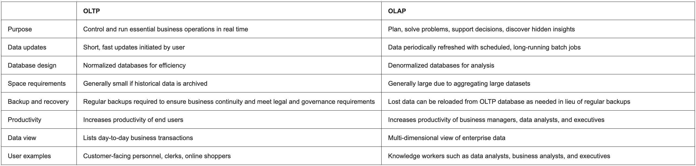
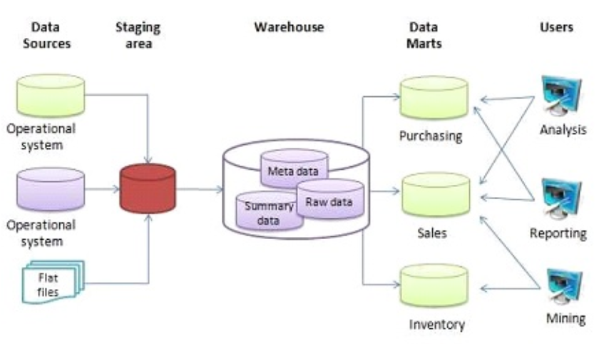
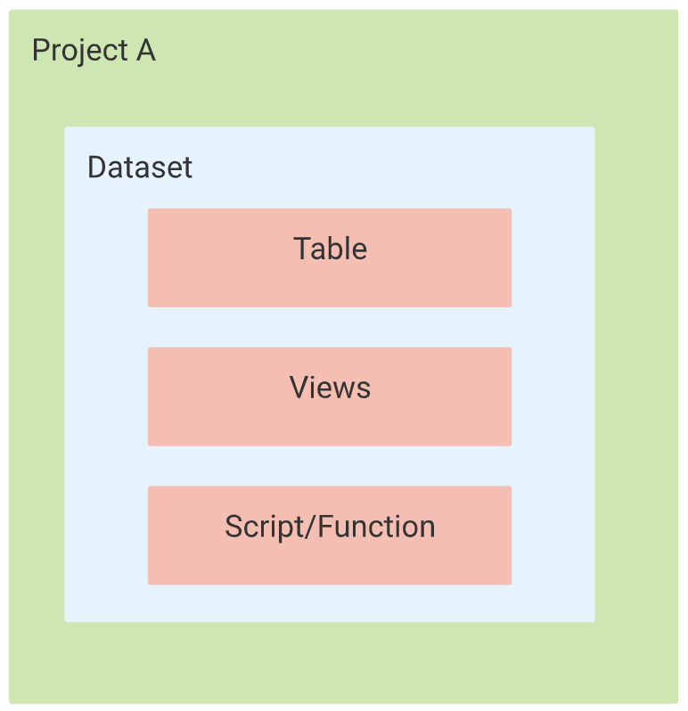
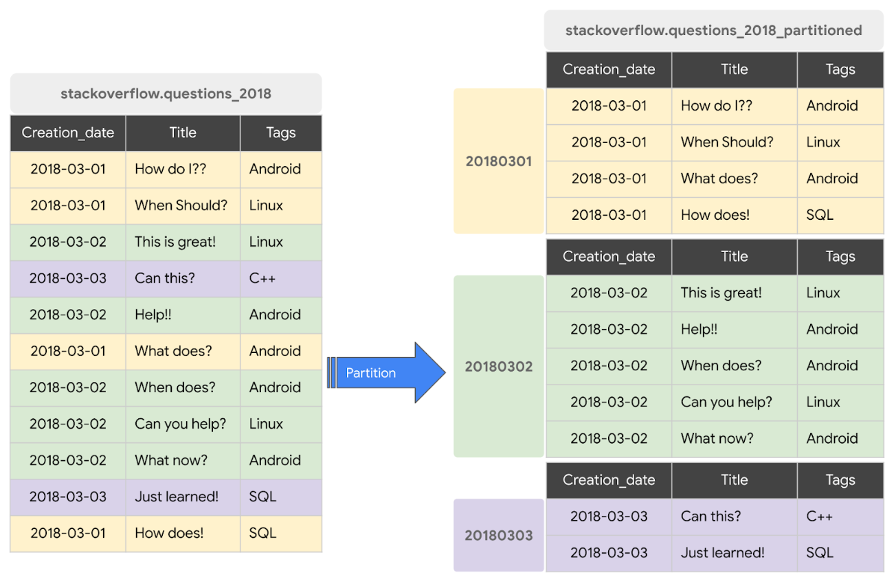
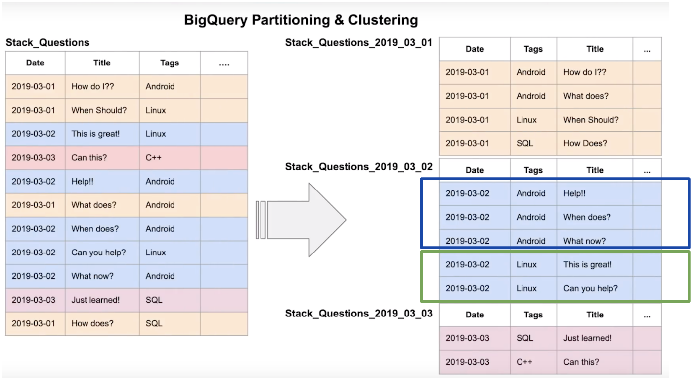
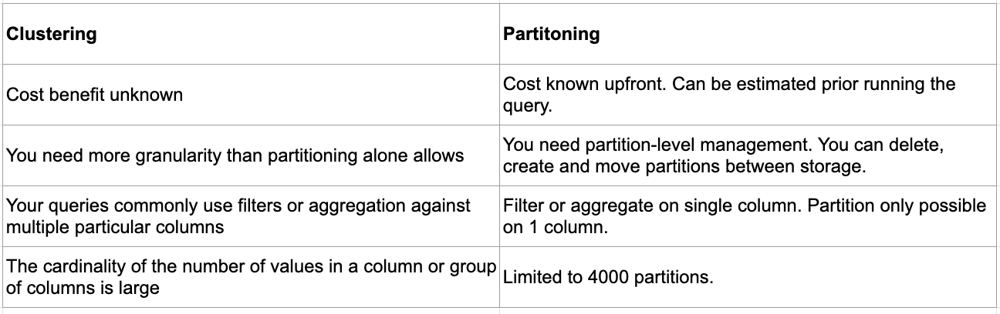
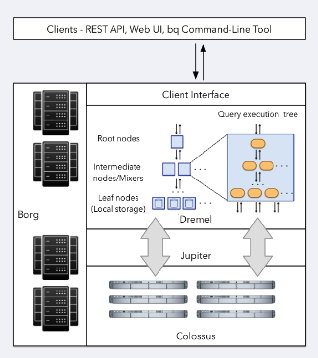
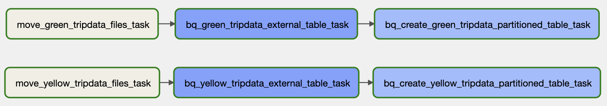
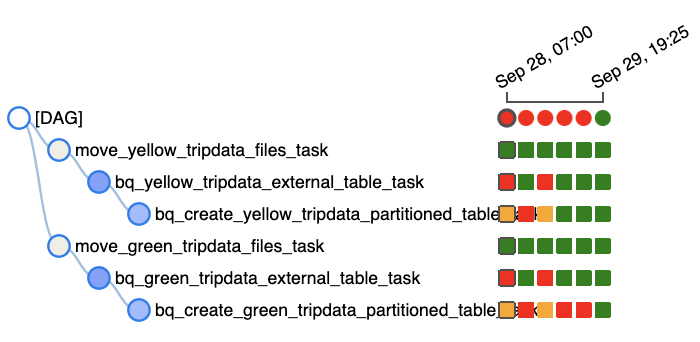
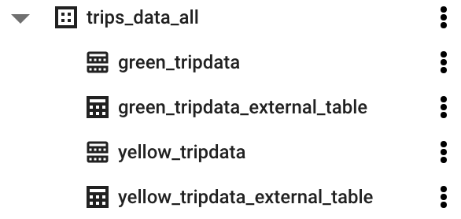

# Week 3 - Course Notes

This week's course will discuss about data ingestion, you can find the repo  <a href="https://github.com/DataTalksClub/data-engineering-zoomcamp/tree/main/week_3_data_warehouse" target="_blank">here</a> and the accompanying course videos  <a href="https://www.youtube.com/watch?v=jrHljAoD6nM&list=PL3MmuxUbc_hJed7dXYoJw8DoCuVHhGEQb&index=27" target="_blank">here</a>.

This notes will cover:
- Data Warehouse Key Concepts.
- BigQuery.
- Machine Learning with BigQuery.
- Integrating BigQuery with Airflow.
- Homework.

## Data Warehouse Key Concepts

Data warehouse is a data repository system that stores and aggregates historical data from multiple sources, processes it, and makes it possible to use the data for critical business analysis, reports and dashboards. 

When talking about data warehouse, we also need to talk about data processing systems. There are 2 data processing systems:
- Online Transactional Processing (OLTP). OLTP captures and maintains trascational-based data. Each transaction involves individual database records made up of multiple columns. OLTP databases are read, written, and updated frequently.

- Online Analytical Processing (OLAP). OLAP applies complex queries to historical data, aggregated from the data source (including OLTP databases). OLAP system is usually used for for data mining, analytics, and business intelligence projects.

The below table shows the difference between OLTP and OLAP.

By above definition, we can see that data warehouse is an OLAP solution and unlike data lake that follows ETL paradigm, data warehouse usually use ETL paradigm.

As shown below, a data warehouse receives raw data from many sources (operational system, flat files, etc) that is stored in a staging area before being written to it. As an output, a data warehouse can further be transformed into data marts which is a subset of a data warehouse that is more targeted to end users' purposes (purchasing, sales, inventory, etc).

## BigQuery

BigQuery (BQ) is a data warehouse solution offered by Google Cloud Platform (GCP). Some of the advantages of BigQuery:
- Serverless data warehouse. There are no servers to manage or database software to install.
- Software as well as infrastructure including scalability and high-availability (able to scale easily as the data volume increases, without any issues).
- Built-in features for machine learning, handling geospatial data analysis and performing business intelligence queries.
- BigQuery maximizes flexibility by separating the compute engine that analyzes your data from your storage (which gives you a huge win in terms of the cost).

BigQuery has many <a href="https://cloud.google.com/bigquery/public-data" target="_blank">public datasets</a> availabe for us to explore. BigQuery pricing has two main components; analysis pricing and storage pricing, you can check them <a href="https://cloud.google.com/bigquery/pricing" target="_blank">here</a>.

BigQuery has a <a href="https://cloud.google.com/architecture/bigquery-data-warehouse" target="_blank">hierarchical structure</a> as shown below. BigQuery organizes tables or views into units called datasets. These datasets are scoped to our GCP project. These multiple scopes — project, dataset, and table — helps us structure our information logically. We can use multiple datasets to separate tables pertaining to different analytical domains, and we can use project-level scoping to isolate datasets from each other according to our business needs.

### Creating External Table

<a href="https://cloud.google.com/bigquery/docs/external-tables" target="_blank">External tables</a> look like standard BigQuery tables. These tables store their metadata and schema in BigQuery storage. However, their data resides in an external source (GCS).

We can create an external table from files (csv, parquet, etc) stored in GCS bucket. The following query will create an external table based on 2 parquet files of yellow taxi trip that we previously have ingested to our bucket in week 2 course.

    -- Creating external table referencing to gcs path
    CREATE OR REPLACE EXTERNAL TABLE `your_project_name.your_dataset_name.external_yellow_tripdata`
    OPTIONS (
      format = 'PARQUET',
      uris = ['gs://your_bucket_name/path_to_your_files/yellow_tripdata_2019-*.parquet', 'gs://your_bucket_name/path_to_your_files/yellow_tripdata_2020-*.parquet']
    );

### Partitioning

BigQuery tables can be partitioned into smaller tables. By dividing a large table into smaller partitions, we can improve query performance and control costs by reducing the number of bytes to read by a query. The amount of processed data when querying a partitioned table versus non-partitioned tabel can be significantly different.

We can partition a table by (with partitions limit of 4000):
- Time-unit column: we can select between daily, hourly and monthly (TIMESTAMP, DATE, or DATETIME column in the table).
- Ingestion time: based on the timestamp when BigQuery ingests the data.
- Integer range: based on an integer column.

Here is how we create a partitioned table, using `PARTITION BY` syntax and `tpep_pickup_datetime` as the partitioned column.

    CREATE OR REPLACE TABLE your_project_name.trips_data_all.yellow_tripdata_partitoned
    PARTITION BY
      DATE(tpep_pickup_datetime) AS
    SELECT * FROM trips_data_all.external_yellow_tripdata;

We can check the amount of rows of each partition in a partitioned table with the following query:

    SELECT table_name, partition_id, total_rows
    FROM `trips_data_all.INFORMATION_SCHEMA.PARTITIONS`
    WHERE table_name = 'yellow_tripdata_partitoned'
    ORDER BY total_rows DESC;

### Clustering

Clustering is another way of organizing data which stores one next to the other all those rows that share similar values in the chosen clustering columns. Clustering can be done based on up to 4 columns. This feature increases the query efficiency and performances.

Few notes to remember when clustering a table in BigQuery:
- Columns you specify are used to colocate related data.
- Order of the column is important.
- The order of the specified columns determines the sort order of the data.
- Clustering improves by our filter and Aggregate queries if we cluster the columns that we want to filter and aggregate.
- Table with data size < 1 GB, don’t show significant improvement with partitioning and clustering.
- You can specify up to four clustering columns.

Clustering columns must be top-level, non-repeated columns. The following datatypes are supported: DATE, BOOL, GEOGRAPHY, INT64, NUMERIC, BIGNUMERIC, STRING, TIMESTAMP and DATETIME.

Here is how we create a partitioned table that can also be clustered, using a additional syntax of `CLUSTER BY` on `VendorID` column.

    CREATE OR REPLACE TABLE your_project_name.trips_data_all.yellow_tripdata_partitoned_clustered
    PARTITION BY DATE(tpep_pickup_datetime)
    CLUSTER BY VendorID AS
    SELECT * FROM trips_data_all.external_yellow_tripdata;

### Partition VS Clustering

You can choose clustering over partitioning if:
- Partitioning results in a small amount of data per partition (approximately less than 1 GB).
- Partitioning results in a large number of partitions beyond the limits on partitioned tables.
- Partitioning results in your mutation operations modifying the majority of partitions in the table frequently (for example, every few minutes).

### BigQuery Best Practices

Best practices for <a href="https://cloud.google.com/blog/products/data-analytics/cost-optimization-best-practices-for-bigquery" target="_blank">cost reduction</a>:
- Avoid `SELECT *`
- Price your queries before running them.
- Use clustered or partitioned tables.
- Use streaming inserts with caution.
- Materialize query results in stages.

Best practices for <a href="https://cloud.google.com/bigquery/docs/best-practices-performance-overview" target="_blank">query performance</a>:
- Filter on partitioned columns.
- Denormalizing data.
- Use nested or repeated columns.
- Use external data sources appropriately as constantly reading from the source may impact the query performance.
- Reduce data before using a `JOIN`.
- Do not treat `WITH` clauses as prepared statements.
- Avoid oversharding tables.
- Avoid JavaScript user-defined functions.
- Use approximate aggregation functions (HyperLogLog++).
- `Order` statement should be put at the last part of query.
- Optimize the join patterns. Put the table with the largest number of rows first, followed by the table with the fewest rows, and then place the remaining tables by decreasing size.

### Internals of BigQuery

Knowing the internals of BigQuery might be beneficial for our data career and journey (such as building data products). The technologies used inside <a href="https://cloud.google.com/blog/products/data-analytics/new-blog-series-bigquery-explained-overview" target="_blank">BigQuery architecture</a> are:
1. Colossus. cluster-level file system, successor to the Google File System (GFS). BigQuery leverages the columnar storage format and compression algorithm to store data in Colossus, optimized for reading large amounts of structured data. Colossus also handles replication, recovery (when disks crash) and distributed management (so there is no single point of failure).

2. Jupiter. Jupiter allows compute and storage (connects Dremel and Colossus) talk to each other through the petabit Jupiter network.

3. Dremel. Dremel is a query execution engine, a large multi-tenant cluster that executes SQL queries. Dremel is compute and turns SQL queries into execution trees.

4. Borg. BigQuery is orchestrated via Borg. The mixers and slots are all run by Borg, which allocates hardware resources.

## Machine Learning with BigQuery

the idea behind ML BQ
pricing?

Let's first look at the steps involved in machine learning:
1. Data collection.
2. Data processing and feature engineering.
3. Spliting the data into training and testing dataset.
4. Model training with the correct algorithm (parameters optimization).
5. Validate the model against different testing datasets.
6. Model deployment.

BigQuery allows us to do feature engineering (it also has automatic feature engineering), split the data into training and testing dataset, choose different algorithms and hyperparameters tuning, error matrices to do our validation and to deploy the model using a docker container.

Here is the <a href="https://cloud.google.com/static/bigquery-ml/images/ml-model-cheatsheet.pdf">cheetsheet</a>, that recommends what algorithm to use different use cases.

For an example, let's create a basic linear regression model to predict the tip amount. The tip amount is the tip paid to the driver at the end of the journey. These are the steps:
1. Gather the required data/information for creating the model and store them in a new table and make sure each data has the appropriate data types. Some feature engineering steps:
  - For example we need to convert `PULocationID` into categorical (`STRING`) instead of `INTEGER`. For more on <a href="https://cloud.google.com/bigquery-ml/docs/reference/standard-sql/bigqueryml-syntax-preprocess-overview" target="_blank">you can visit here</a>.
  - Drop all records that has 0 `tip_amount`.

        CREATE OR REPLACE TABLE `your_project_name.trips_data_all.yellow_tripdata_ml` (
          `passenger_count` INTEGER,
          `trip_distance` FLOAT64,
          `PULocationID` STRING,
          `DOLocationID` STRING,
          `payment_type` STRING,
          `fare_amount` FLOAT64,
          `tolls_amount` FLOAT64,
          `tip_amount` FLOAT64
        ) AS (
          SELECT passenger_count, trip_distance, CAST(PULocationID AS STRING), CAST(DOLocationID AS STRING), CAST(payment_type AS STRING), fare_amount, tolls_amount, tip_amount
          FROM `trips_data_all.yellow_tripdata_partitoned`
          WHERE fare_amount != 0
        );

2. Create a model with default setting. Named the model as `tip_model` and specify the `model_type` as `linear_reg`, `input_label_cols` which is the variable that we want to predict as `tip_amount` and `DATA_SPLIT_METHOD` as `AUTO_SPLIT` for splitting the data into training and testing dataset.

        CREATE OR REPLACE MODEL `your_project_name.trips_data_all.tip_model`
        OPTIONS (
          model_type='linear_reg',
          input_label_cols=['tip_amount'],
          DATA_SPLIT_METHOD='AUTO_SPLIT'
        ) AS
        SELECT
          *
        FROM
          `your_project_name.trips_data_all.yellow_tripdata_ml`
        WHERE
          tip_amount IS NOT NULL;

   Next, we can check our features information with:

        SELECT * FROM ML.FEATURE_INFO(MODEL `your_project_name.trips_data_all.tip_model`);

3. Evaluate the model. We can simply use `ML.EVALUATE` to validate our model, as shown below:

        SELECT
          *
        FROM
        ML.EVALUATE(
          MODEL `your_project_name.trips_data_all.tip_model`, (
            SELECT
              *
            FROM
              `your_project_name.trips_data_all.yellow_tripdata_ml`
            WHERE
              tip_amount IS NOT NULL
          )
        );

4. Prediction. We use `ML.PREDICT` statement to make some predictions. The `SELECT` statement within `ML.PREDICT` provides the records for which we want to make predictions.

        SELECT
          *
        FROM
        ML.PREDICT(
          MODEL `your_project_name.trips_data_all.tip_model`, (
            SELECT
              *
            FROM
              `your_project_name.trips_data_all.yellow_tripdata_ml`
            WHERE
              tip_amount IS NOT NULL
          )
        );

   We can also use `ML.EXPLAIN_PREDICT` statement to return the prediction results along with the most important features that were involved in calculating the prediction. `STRUCT(3)` will return the top 3 features.

        SELECT
          *
        FROM
        ML.EXPLAIN_PREDICT(
          MODEL `your_project_name.trips_data_all.tip_model`,(
            SELECT
              *
            FROM
              `your_project_name.trips_data_all.yellow_tripdata_ml`
            WHERE
              tip_amount IS NOT NULL
          ), STRUCT(3 as top_k_features)
        );

5. Parameter tuning. In BigQuery we can perform hyperparameter tuning by stating the regularizations that we want to use when create the model (`l1_reg` and `l2_reg`).

        CREATE OR REPLACE MODEL `your_project_name.trips_data_all.tip_hyperparam_model`
        OPTIONS (
          model_type='linear_reg',
          input_label_cols=['tip_amount'],
          DATA_SPLIT_METHOD='AUTO_SPLIT',
          num_trials=5,
          max_parallel_trials=2,
          l1_reg=hparam_range(0, 20),
          l2_reg=hparam_candidates([0, 0.1, 1, 10])
        ) AS
        SELECT
        *
        FROM
        `your_project_name.trips_data_all.yellow_tripdata_ml`
        WHERE
        tip_amount IS NOT NULL;

6. Deployment. We can deploy our model using Docker containers by running <a href="https://www.tensorflow.org/tfx/serving/docker" target="_blank">TensorFlow Serving</a>. Follow these steps as referenced from <a href="https://cloud.google.com/bigquery-ml/docs/export-model-tutorial" target="_blank">here</a>:
     - Authenticate to your GCP. Go to terminal and run `gcloud auth login`.

     - Export the model to a Cloud Storage bucket with this command `bq --project_id your_project_id extract -m trips_data_all.tip_model gs://taxi_ml_model/tip_model`.

     - Download the exported model files to a temporary directory, `mkdir /tmp/model` and `gsutil cp -r gs://taxi_ml_model/tip_model /tmp/model`.

     - Create a version subdirectory.

              mkdir -p serving_dir/tip_model/1
              cp -r /tmp/model/tip_model/* serving_dir/tip_model/1
              rm -r /tmp/model

     - Pull the TensorFlow Serving Docker image `docker pull tensorflow/serving`.

     - Run the Docker container.

              docker run \
                -p 8501:8501 \
                --mount type=bind,source=`pwd`/serving_dir/tip_model,target=/models/tip_model \
                -e MODEL_NAME=tip_model \
                -t tensorflow/serving &

     - Run a prediction with curl.

              curl \
                -d '{"instances": [{"passenger_count":1, "trip_distance":12.2, "PULocationID":"193", "DOLocationID":"264", "payment_type":"2","fare_amount":20.4,"tolls_amount":0.0}]}' \
                -X POST http://localhost:8501/v1/models/tip_model:predict

For more on how to best use BigQuery ML, <a href="https://cloud.google.com/bigquery-ml/docs" target="_blank">you can visit here</a>.

## Integrating BigQuery with Airflow

Here are the steps to create BigQuery tables (external & partitioned) from the parquet files in our GCS (ingested last week).

1. Copy and create the following folders and files from week 2 course to your week 3 directory in a folder named `airflow`:
    - Copy dags folder and `data_ingestion_gcs_dag.py` file.
    - Create new folders of `logs`, `plugins` and `scripts`.
    - Copy `docker-compose.yaml` file
    - Copy `Dockerfile`.
    - Copy `requirements.txt` file.
    - Copy `.env` file.

2. Then, build the docker image with `docker-compose build`. Once done, initialize the airflow services with `docker-compose up airflow-init` and run the airflow and containers with `docker-compose up -d`.

3. Now, let's start to create our dag. Go to `data_ingestion_gcs_dag.py` file and rename it to `gcs_to_bq_dag.py` and remove some of these lines as we are not going to use them.

        from airflow.operators.bash import BashOperator
        from airflow.operators.python import PythonOperator
        from google.cloud import storage

        dataset_file = "yellow_tripdata_2021-01.parquet"
        dataset_url = f"https://d37ci6vzurychx.cloudfront.net/trip-data/{dataset_file}"
        upload_to_gcs fuction
        download_dataset_task
        local_to_gcs_task

4. Import these additional libraries.

        from airflow.providers.google.cloud.operators.bigquery import BigQueryCreateExternalTableOperator, BigQueryInsertJobOperator
        from airflow.providers.google.cloud.transfers.gcs_to_gcs import GCStoGCSOperator

  - `BigQueryCreateExternalTableOperator` and `BigQueryInsertJobOperator` is used to create external and partitioned tables.
  - `GCStoGCSOperator` is used to organized the files in our GCS.

5. Create these variables to help us in processing the dags.

        DATASET = "tripdata"
        COLOUR_RANGE = {"yellow": "tpep_pickup_datetime", "green": "lpep_pickup_datetime"}
        INSERT_QUERY = {"yellow": "SELECT * EXCEPT(airport_fee)", 'green': "SELECT * EXCEPT(ehail_fee)"}
        INPUT_PART = "raw"
        INPUT_FILETYPE = "parquet"

  - `COLOUR_RANGE` will be used to loop through all the filenames.
  - `INSERT_QUERY` to ignore some columns in yellow and green taxi tables that caused some errors (unmatched data types). `Parquet column 'airport_fee' has type INT32 which does not match the target cpp_type DOUBLE`. `Parquet column 'ehail_fee' has type INT32 which does not match the target cpp_type DOUBLE`.
  - `INPUT_PART` is the folder where our data resides in our bucket.

6. Next, change the `dag_id` to `gcs_2_bq_dag` and create a for loop that will loop through all out taxi types (yellow & green) data and creating 3 tasks:
  - Task of organizing our file in GCS to ease our BigQuery table creation, `move_files_gcs_task`. I set the `move_object` to `False` as I want to leave a copy of the file in `raw` folder. Switch it to `True` if you want to permanently move the files out of the `raw` folder.

         for colour, ds_col in COLOUR_RANGE.items():

              move_files_gcs_task = GCSToGCSOperator(
                  task_id=f'move_{colour}_{DATASET}_files_task',
                  source_bucket=BUCKET,
                  source_object=f'{INPUT_PART}/{colour}_{DATASET}*.{INPUT_FILETYPE}',
                  destination_bucket=BUCKET,
                  destination_object=f'{colour}/{colour}_{DATASET}',
                  move_object=False
              )

  - Task of creating BigQuery external tables, `bigquery_external_table_task`.

        bigquery_external_table_task = BigQueryCreateExternalTableOperator(
            task_id=f"bq_{colour}_{DATASET}_external_table_task",
            table_resource={
                "tableReference": {
                    "projectId": PROJECT_ID,
                    "datasetId": BIGQUERY_DATASET,
                    "tableId": f"{colour}_{DATASET}_external_table",
                },
                "externalDataConfiguration": {
                    "autodetect": "True",
                    "sourceFormat": f"{INPUT_FILETYPE.upper()}",
                    "sourceUris": [f"gs://{BUCKET}/{colour}/*"],
                },
            },
        )
        
  - Task of creating partitioned tables from the external tables, `bq_create_partitioned_table_job`. `CREATE_BQ_TBL_QUERY` contains an instruction to create partition tables that will later be passed on to `BigQueryInsertJobOperator`.

        CREATE_BQ_TBL_QUERY = (
              f"CREATE OR REPLACE TABLE {BIGQUERY_DATASET}.{colour}_{DATASET} \
              PARTITION BY DATE({ds_col}) \
              AS \
              {INSERT_QUERY[colour]} FROM {BIGQUERY_DATASET}.{colour}_{DATASET}_external_table;"
        )

        bq_create_partitioned_table_job = BigQueryInsertJobOperator(
            task_id=f"bq_create_{colour}_{DATASET}_partitioned_table_task",
            configuration={
                "query": {
                    "query": CREATE_BQ_TBL_QUERY,
                    "useLegacySql": False,
                }
            }
        )

7. And finally, define the task dependencies at the of the dag with the following execution order `move_files_gcs_task >> bigquery_external_table_task >> bq_create_partitioned_table_job`.

8. Next go to your airflow UI (localhost:8080) and run the dag.

9. And go to BigQuey UI, refresh the browsers and your should see all the external and partitioned tables under your `trips_data_all` dataset.

## Homework

You can see the queries <a href="https://github.com/Balurc/data_eng_zoomcamp/blob/main/week3_data_warehouse/homework/homework.sql" target="_blank">here</a>.

### Question 1: 
What is count for fhv vehicles data for year 2019? The answer is 43261276.

### Question 2: 
How many distinct dispatching_base_num we have in fhv for 2019? The answer is 799.

### Question 3: 
What is the best strategy to optimise if a query always filter by dropoff_datetime and order by dispatching_base_num?
The answer is partition by dropoff_datetime (TIMESTAMP) and cluster by dispatching_base_num (STRING/CATEGORICAL).

### Question 4: 
What is the count, estimated and actual data processed for query which counts trip between 2019/01/01 and 2019/03/31 for dispatching_base_num B00987, B02060, B02279?
The answer is:

    Count: 28058
    Estimated data processed: 421.1MB
    Actual data processed: 157MB
    
### Question 5: 
What will be the best partitioning or clustering strategy when filtering on dispatching_base_num and SR_Flag?
The answer is cluster by dispatching_base_num and SR_FLAG (if its a STRING, or if its an INTEGER, use partition).

### Question 6: 
What improvements can be seen by partitioning and clustering for data size less than 1 GB?
The answer is there would be no improvements, and even could be worse due to metadata. We can see the improvements with a larger data size.

### Question 7: 
In which format does BigQuery save data? The answer is columnar.
