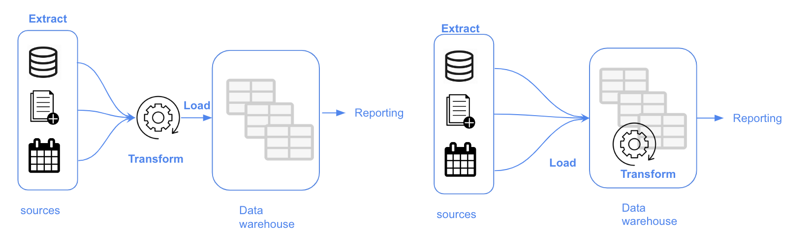
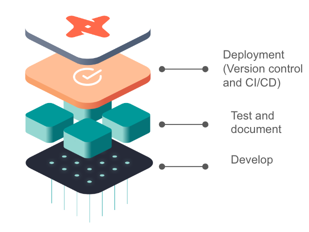
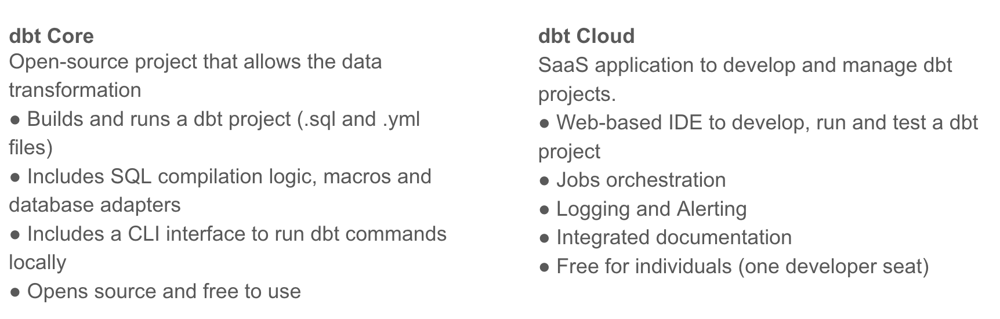

# WEEK 4 - Course Notes

This week's course will discuss analytics engineering, you can find the repo  <a href="https://github.com/DataTalksClub/data-engineering-zoomcamp/tree/main/week_4_analytics_engineering" target="_blank">here</a> and the accompanying course videos <a href="https://www.youtube.com/watch?v=uF76d5EmdtU&list=PL3MmuxUbc_hJed7dXYoJw8DoCuVHhGEQb&index=36" target="_blank">here</a>.

This notes will cover:
- Basics of Analytics Engineering
- dbt (Data Build Tool)

## Basics of Analytics Engineering

The recent development in data domain/technologies have rapidly changed the way the data teams working. . This development have introduced us with some new "modern data stack" tools that able to help organzation to save time, effort and money. 
- Massive parrallel processing (MPP) databases, such as BigQuery, Redshift, Snowflake, etc.
- Data-pipelines-as-a-service, simplify the ETL process with tools such as Fivetran & Stitch.
- SQL first and version control systems tool such as Looker.
- Self service analytics tool, such as Mode.
- Data governance.

This development has also changed the way stakeholders consume the data, and left a gap in the roles we had in the data team. Previously we have:
- Data engineer prepares and maintain the infrastructure that the data team will need.
- Data analyst/scientist utilizes data hosted in the infrastruture to answer questions, solve business problems and create prediction models (data scientist).

With these new tools inplace, there are 2 trends we can see nowdays that has left a gap:
- Data analysts and data scientists that write more and more code even though they are not meant to be software engineers and haven't been trained for it. 
- And also data engineers who have good software engineering skills but they are not trained for answering and solving business problems.

This is the gap that the <a href="https://www.getdbt.com/what-is-analytics-engineering/" target="_blank">analytics engineer</a> is trying to fill. It introduces good software engineering practices to the efforts of data analysts and data scientists.
Some tools that an analytics engineer might be exposed to:
- Data loading (Fivetran, Stitch, etc).
- Data storing (BigQuery, Snowflake, etc).
- Data modelling (dbt, Dataform, etc).
- Data presentation (Tableau, Looker, etc).

### Data Modelling Concepts

Let's recap some of some of data modelling concepts on ETL and ELT that we have covered in previous lessons.
- In ETL, we are going to extract data from the sources and transform it and then load it to a data warehouse. This approach will take longer to implement because we first have to transform the data, but this also means that we are going to have more stable and compliant data because it's clean.
- In ELT, we are going to transform the data once it is in the data warehouse. This approach is faster and more flexible to implement than ETL's   because all the data will be loaded and transformed in the same data warehouse.

### Dimensional Modelling

The objectives of dimensional modelling (Ralph Kimball) are:
- To deliver data that business users can easily understand.
- To deliver fast query performance.

Other approaches of dimensional data modelling are <a href="https://www.astera.com/type/blog/data-warehouse-concepts/" target="_blank">Bill Inmon's</a>  and <a href="https://en.wikipedia.org/wiki/Data_vault_modeling" target="_blank">data vault</a>.

### Elements of Dimensional Modelling

The dimensional modelling concept is mainly about two types of table; fact tables and dimensional tables, also known as <a href="https://en.wikipedia.org/wiki/Star_schema" target="_blank">Star Schema modelling</a>.

Fact tables are:
- One that holds information on some quantitative metrics (i.e. measurements), over which some sort of calculation can be performed. Some common examples of facts tables include orders, logs and time-series financial data. Some examples of fact tables are orders and sales.
- Contain facts about a business process.
- Can be thought of as "verbs".

Dimension tables are:
- Provide context to fact tables.
- Correspond to business identity.
- Can be thought of as "nouns".

An analogy that we use to think and describe about Kimball's dimensional modelling is the restaurant analogy. In this analogy we have 3 areas:
- Stage area - the kitchen storage. The area that contains raw data and not meant to exposed to everyone.
- Processing area - the kitchen. The area where we process the raw data into data models in efficient manners and follow the agreed standards. This area is limited to people who knows how to do data modelling (which in the restaurant analogy, only the cook).
- Presentation area - the dining hall. The area where we have the exposure to business users and stakeholders and present our data.

## dbt (Data Build Tool)

### What is dbt?

dbt stands for data built tool. dbt helps with the transformation process of our data so that we can expose them to the business users in the form of reports or vizualizations.

dbt allows us to transform raw data with SQL following software engineering best practices like modularity, portability, model deployment (with version control & CI/CD) and testing & documentation.

### How dbt works?

It works by adding model layers to the data warehouse and the purpose of these models is to transform the raw data into tables or views. The transformed data will later be persited back to the data warehouse. A model layer is a SQL file that contains a set of `SELECT` instructions (DQL) with no DDL or DML instructions. dbt will compile the code by creating the DDL or DML file and push it to the data warehouse.

### How to use dbt?

dbt has 2 products:

The fundamental difference between dbt Core and dbt Cloud is the way we work with each. To work with dbt Core we will use command-line interface (CLI), and for dbt Cloud we will use it's integrated development environment (IDE). 

In this week's course, we are going to transform the raw data and create data models with dbt Cloud. We are also going to do the deployment and orchestration in dbt Cloud. If you want to develop the data models with postgres database, you can do that with dbt Core and running the models through the CLI. 

### Intial Setup

To begin, creates 2 new datasets in your BigQuery and a repository from scratch:
- 1 datasets for developing evironmrnt, to create the data models.
- 1 datasets for production, to run the models after deployment.
- Create a new repository from scratch, here as a <a href="https://github.com/DataTalksClub/data-engineering-zoomcamp/tree/main/week_4_analytics_engineering" target="_blank">reference</a>.

### dbt Cloud Setup with BigQuery

Follow these steps to setup your dbt Cloud with BigQuery and additionally, you can follow the detailed guides <a href="https://github.com/DataTalksClub/data-engineering-zoomcamp/blob/main/week_4_analytics_engineering/dbt_cloud_setup.md" target="_blank">here</a>.

1. Create a BigQuery Service Account.
    - Go <a href="https://console.cloud.google.com/apis/credentials/wizard" target="_blank">here</a> and create a service account. Select `BigQuery Admin` role, click `CONTINUE` and `DONE`.
    - Next, go to the service account that you just create and click on `KEYS` tab, then click `ADD KEY` and select `CREATE NEW KEY`, pick `JSON` key type and click `CREATE` to create and download your service account key.

2. Create a dbt Cloud Project.
    - Go <a href="https://www.getdbt.com/pricing/" target="_blank">here</a> and create free dbt developer account. Once logged in, you will be prompt to create a new project.
    - Next, click on `BEGIN` and select `BigQuery` as your database connection.
    - Upload the downloaded service account key on the `create from file` option. 
    - Next, scroll down to the end of the page and in the `Development Credentials` section put the dataset name in the BigQuery where you are going to develop you dbt models.
    - To finalize, click on `Test` and continue with the setup.

3. Add Github Repository.
    - Go to your GitHub account, select git clone and paste the SSH key from your repo.
    - Once you get the deploy key, go to your GitHub repo again and go to the setting tabs. Under security select deploy keys, then click on `add deploy key` and paste the deploy key and tick on "write access" and click `Add Key`.

If you want to use dbt Core instead, follow these guides:
- Guide to install <a href="https://docs.getdbt.com/dbt-cli/install/overview" target="_blank">dbt Core</a>.
- Setup  <a href="https://github.com/DataTalksClub/data-engineering-zoomcamp/tree/main/week_4_analytics_engineering/docker_setup" target="_blank">dbt with BigQuery on Docker</a>.

### Development of dbt Models

#### Anatomy of a dbt model

Before we start creating the data models, let's first have look at the structure and elements that we are going to see in dbt:

- `Jinja` in dbt. <a href="https://jinja.palletsprojects.com/en/3.1.x/templates/" target="_blank">Jinja</a> for SQL is a template language for SQL statements and script. Jinja statement starts and ends with 2 curly brackets `{{ sql_statement_here }}`.

- `Macros`. <a href="https://docs.getdbt.com/docs/building-a-dbt-project/jinja-macros#macros">Macros</a> in Jinja are pieces of code that can be reused multiple times – they are analogous to "functions" in other programming languages, and are extremely useful if you find yourself repeating code across multiple models.

- By default, dbt provides 4 materialization strategies:
  - Table - drop the table if it already exists in our data warehouse and create the table in the schema that we are working with.
  - View - is exactly the same as table but here it would be something like `CREATE` or `ALTER`.
  - Incremental - run our model and transform and insert latest data only to our table, useful for data that doesn't really change everyday.
  - Ephemeral - creates `CTE` that separated in another file.
 

#### The FROM clause

There are 2 sources in dbt that can be defined from the `FROM` clause:
- <a href="https://docs.getdbt.com/docs/building-a-dbt-project/using-sources">Sources</a>; the data loaded to our data warehoouse that we use as sources for our data models.
  - We use `source()` function and the configuration is defined in the yml files (model's folder).
  - Used with source macro that will resolve the name to the right schema, plus build the dependencies automatically.
  - Source freshness can be defined and tested, which can be useful to check whether our data pipelines are working properly.

An example of how to declare a source in a yml file:

    sources:
        - name: staging
          database: production
          schema: trips_data_all

          loaded_at_field: record_loaded_at
          tables:
            - name: green_tripdata
            - name: yellow_tripdata
              freshness:
                error_after: {count: 6, period: hour}

An example of how to reference source in a SQL statement under `FROM` clause: 

    FROM {{ source('staging','yellow_tripdata') }}

- <a href="https://docs.getdbt.com/docs/building-a-dbt-project/seeds">Seeds</a>; csv files stored under `seeds` folder and can be loaded to our data warehouse.
  - Use `ref()` function to refer to the seed in the model's folder.
  - Run `dbt seed -s filename` to create a table in our data warehouse.
  - Recommended for data that doesn't change frequently.

An example of how to reference seeds in a SQL statement under `FROM` clause: 

    SELECT
        locationid,
        borough,
        zone,
        replace(service_zone, 'Boro', 'Green') as service_zone
    FROM {{ ref('taxi_zone_lookup) }}

#### Define a source and develop models.

Let's create our first model and follow these steps:
1. On your dbt Cloud, create 2 folders under your `models` folder named as `staging` and `core`. And delete the `example` folder.

2. Under staging create a yaml file named `schema.yml` and let's define our sources and tables here. Write below statements and click save.

        version: 2

        sources:
            - name: staging
              database: your_projectid
              schema: trips_data_all

              tables:
                  - name: green_tripdata_external_table
                  - name: yellow_tripdata_external_table

3. Next, create a new SQL file named `sgt_green_trip_data.sql` and let's write something to create our first model as below and click save.
        # We'll create a view
        {{ config(materialized='view') }}

        SELECT
                -- identifiers
            cast(vendorid as integer) as vendorid,
            cast(ratecodeid as integer) as ratecodeid,
            cast(pulocationid as integer) as  pickup_locationid,
            cast(dolocationid as integer) as dropoff_locationid,

            -- timestamps
            cast(lpep_pickup_datetime as timestamp) as pickup_datetime,
            cast(lpep_dropoff_datetime as timestamp) as dropoff_datetime,

            -- trip info
            store_and_fwd_flag,
            cast(passenger_count as integer) as passenger_count,
            cast(trip_distance as numeric) as trip_distance,
            cast(trip_type as integer) as trip_type,

                -- payment info
            cast(fare_amount as numeric) as fare_amount,
            cast(extra as numeric) as extra,
            cast(mta_tax as numeric) as mta_tax,
            cast(tip_amount as numeric) as tip_amount,
            cast(tolls_amount as numeric) as tolls_amount,
            cast(ehail_fee as numeric) as ehail_fee,
            cast(improvement_surcharge as numeric) as improvement_surcharge,
            cast(total_amount as numeric) as total_amount,
            cast(payment_type as integer) as payment_type,
            cast(congestion_surcharge as numeric) as congestion_surcharge

        FROM {{ source('staging', 'green_tripdata_external_table') }}
        LIMIT 100

4. You can run the model with `dbt run --select your_model_name` or `dbt run -m your_model_name` or `dbt run -f your_model_name`. For more on dbt commands you can visit <a href="https://docs.getdbt.com/reference/dbt-commands">here</a>.

5. Now go to your BigQuery and you should see there is a view created under your development dataset named `stg_green_trip_data`.

  
#### Macros

Macros are similar to functions in programming language that are written in Jinja template. dbt already has some macros inside such as `source()`, `ref()` and `config()`. Macros are going to return code, not a result like an UDF.

Macros enable us to:
- Use control structures such as if statements or for loops in SQL.
- Use environment variables in our dbt project for production.
- Operate on the results of one query to generate another query.
- Abstract snippets of SQL into reusable macros - analogous to functions in most programming langguages.
- Use the macro for another project in our project.

Macros are stored in a macros directory, in a SQL file. Here is an example of macros:

    {# This macro returns the description of the payment_type #}

    

        case {{ payment_type }}
            when 1 then 'Credit card'
            when 2 then 'Cash'
            when 3 then 'No charge'
            when 4 then 'Dispute'
            when 5 then 'Unknown'
            when 6 then 'Voided trip'
        end

    

- It starts with `macro` keyword that indicates a macro definition and ends with `endmacro` keyword.
- The macro will accept a parameter `payment_type` and we use expression delimiters `{{...}}` to access the parameter. 
- The {#...#} delimiter is for comments, to explain what the marcos are trying to do.
- The  delimiter is the control blocks for macros statements/definitions.
- The {{...}} delimiter is macro expressions (literals, math, comparisons, logic, macro calls, etc).

Follow these steps to include macros in our dbt project:
1. Go to `macros` folder and create a new SQL file named `get_payment_type_description.sql`.

2. Then write the following statements in the file to map the payment type with its description, and click save.

        {# This macro returns the description of the payment_type #}

        

            case {{ payment_type }}
                when 1 then 'Credit card'
                when 2 then 'Cash'
                when 3 then 'No charge'
                when 4 then 'Dispute'
                when 5 then 'Unknown'
                when 6 then 'Voided trip'
            end

        

3. Now go to `stg_green_trip_data.sql` and under the `SELECT` statements add the following, and click save.

  {{ get_payment_type_description('payment_type') }} as payment_type_description

4. Once ready, you can run the model with `dbt run --select your_model_name` in my case it's `dbt run --select stg_green_trip_data.sq`.

5. Now go to your BigQuery and on your `stg_green_trip_data` view you should see there is a new column created `payment_type_description`.

#### Packages

Just like in other programming langguages, in dbt we can use packages (or modules/libraries in other programming languages). Packages are basically the standalone dbt projects that have modules and macros of their own (such as test). 

To import a package we first need to create `packages.yml` file (main directory of our project) that will define the packages that we want to import. You can find a lot of useful packages <a href="https://hub.getdbt.com/">here</a>.

    packages:
      - package: dbt-labs/dbt_utils
        version: 0.8.0

We can access the marcos inside the packages in a similar way as how we access a class methods in Python. To use a package, we first need to install them. We can intall a package by running the `dbt deps` command.

Follow these steps to include packages in our dbt project:

1. Go to your the main directory of your project and create `packages.yml` file and import the following package, click save.

        packages:
          - package: dbt-labs/dbt_utils
            version: 0.8.0

2. Next in order to use the package, we need to install it first. Now run `dbt deps` command on your dbt Cloud to install the package. After you run the command, you can see a `dbt_utils` folder (under `dbt_packages` folder) that contains all the macros from `dbt_utils` package.

3. Now let's create a surrogate key with the help of `dbt_utils` macro: `surrogate_key()`. Add the following in your `SELECT` statement and click save.

    {{ dbt_utils.surrogate_key(['vendorid', 'lpep_pickup_datetime']) }} as tripid

4. Once ready, you can run the model with `dbt run --select your_model_name`. Now go to your BigQuery and on your `stg_green_trip_data` view you should see there is a new column created `tripid`.

#### Variables

Variables are useful for defining values that will be used across your project. With macros, they will fetch the data from the variables and translate it during the compilation process.

There are 2 ways we can define environment variables:
- On CLI
- On `dbt_project.yml` file, similar to what a global variable is. We define the variables under the `vars` block.

        vars:
            payment_type_values: [1, 2, 3, 4, 5, 6]

To access the variables, we can user `var()` macro.

    

        limit 100

    

Follow these steps as an example of how to include variables in our dbt project:

1. Go to your `stg_green_trip_data.sql` file and add the following right after `FROM` clause, click save.

        WHERE vendorid is not null
        

            limit 100

        

2. Once ready, you can run the model with `dbt run --select your_model_name`.

#### Creating and using dbt seed

dbt seeds are csv files that we can have in our repo and use them as tables with `ref()` macro. dbt seeds are meant to be used for smaller files (data that will not change).

Follow these steps as an example of how to use dbt seeds in our dbt project:

1. Go to your `seeds` folder and create a new file `taxi_zone_lookup.csv`.
2. Copy the values in taxi zones lookup file and paste them to `taxi_zone_lookup.csv` file that you just created.
3. Next, run `dbt seeds` command to load the csv file to database.
4. Now if you go to your BigQuery and on your development dataset, you should see a new table has been created `taxi_zone_lookup`.
5. Next let's create a model that is based on the seed we just created. Under `model` folder, go to `core` folder and create a new file `dim_zones.sql`.
6. Write the following statements:

        {{ config(materialized='table') }}

        select 
            locationid, 
            borough, 
            zone, 
            replace(service_zone,'Boro','Green') as service_zone
        from {{ ref('taxi_zone_lookup') }}

7. Next create a new file `fact_trips.sql` and write the following statements and click save.

        {{ config(materialized='table') }}

        with green_data as (
            select *, 
                'Green' as service_type 
            from {{ ref('stg_green_trip_data') }}
        ), 

        yellow_data as (
            select *, 
                'Yellow' as service_type
            from {{ ref('stg_yellow_trip_data') }}
        ), 

        trips_unioned as (
            select * from green_data
            union all
            select * from yellow_data
        ), 

        dim_zones as (
            select * from {{ ref('dim_zones') }}
            where borough != 'Unknown'
        )
        select 
            trips_unioned.tripid, 
            trips_unioned.vendorid, 
            trips_unioned.service_type,
            trips_unioned.ratecodeid, 
            trips_unioned.pickup_locationid, 
            pickup_zone.borough as pickup_borough, 
            pickup_zone.zone as pickup_zone, 
            trips_unioned.dropoff_locationid,
            dropoff_zone.borough as dropoff_borough, 
            dropoff_zone.zone as dropoff_zone,  
            trips_unioned.pickup_datetime, 
            trips_unioned.dropoff_datetime, 
            trips_unioned.store_and_fwd_flag, 
            trips_unioned.passenger_count, 
            trips_unioned.trip_distance, 
            trips_unioned.trip_type, 
            trips_unioned.fare_amount, 
            trips_unioned.extra, 
            trips_unioned.mta_tax, 
            trips_unioned.tip_amount, 
            trips_unioned.tolls_amount, 
            trips_unioned.ehail_fee, 
            trips_unioned.improvement_surcharge, 
            trips_unioned.total_amount, 
            trips_unioned.payment_type, 
            trips_unioned.payment_type_description, 
            trips_unioned.congestion_surcharge
        from trips_unioned
        inner join dim_zones as pickup_zone
        on trips_unioned.pickup_locationid = pickup_zone.locationid
        inner join dim_zones as dropoff_zone
        on trips_unioned.dropoff_locationid = dropoff_zone.locationid

Below snippet references `sgt_green_trip_data` model that we created before. Since a model outputs a table/view, we can use it in the `FROM` clause of any query.

    with green_data as (
        select *, 
            'Green' as service_type 
        from {{ ref('stg_green_trip_data') }}
    )

8. Once ready, you can run the model with `dbt run` to run all the models that we have created so far. You can also use `dbt build` command to run the models, seeds and tests. If you have this error `Access Denied: BigQuery BigQuery: Permission denied while globbing file pattern.`, go to your Google IAM --> your dbt service account and make sure the `viewers` role is assigned.

### Testing and documenting dbt models

For a matured project, it is suggested to apply a decent testing method and documentation in our project.

#### Testing

Test is an assumption we make about our data or a behavior tha our data should have. Tests in dbt are essentially a `SELECT` sql query. This means we are going to run dbt tests and it's going to compile to a SQL query that will return the amount of failing records that do not follow the assumptions we made about our data.

Tests are defined in the yml file under the column name. dbt provides basic tests to check if the column values are:
- Unique
- Not null 
- Accepted values
- A foreign key to another table

As an example:

    models:
        - name: stg_green_tripdata
          description: >
            Trip made by green taxis, also known as boro taxis and street-hail liveries.
            Green taxis may respond to street hails,but only in the areas indicated in green on the
            map (i.e. above W 110 St/E 96th St in Manhattan and in the boroughs).
            The records were collected and provided to the NYC Taxi and Limousine Commission (TLC) by
            technology service providers. 
          columns:
              - name: tripid
                description: Primary key for this table, generated with a concatenation of vendorid+pickup_datetime
                tests:
                    - unique:
                        severity: warn
                    - not_null:
                        severity: warn

Above example shows there are two tests `unique` and `not_null` under `tests` and `tripid` block and column. If there is an error, the tests will return a warning in the command line.

#### Documentation

dbt provides a way to generate documentation for your dbt project and render it as a website.

The documentation for your project includes:
- Information about your project: 
  - Model code (both from the .sql file and compiled)
  - Model dependencies
  - Sources
  - Auto generated DAG from the ref and source macros
  - Descriptions (from .yml file) and tests 
- Information about your data warehouse (information_schema):
  - Column names and data types
  - Table stats like size and rows
- dbt docs can also be hosted in dbt cloud

We can document our model in dbt by writing the documentation in the yml file, such as below. Here we write our documentation in the `description` block. 

    models:
        - name: stg_green_tripdata
          description: >
            Trip made by green taxis, also known as boro taxis and street-hail liveries.
            Green taxis may respond to street hails,but only in the areas indicated in green on the
            map (i.e. above W 110 St/E 96th St in Manhattan and in the boroughs).
            The records were collected and provided to the NYC Taxi and Limousine Commission (TLC) by
            technology service providers. 

dbt docs can be generated on the cloud or locally with `dbt docs generate` command.

### Deployment of a dbt project (using dbt Cloud)

Deployment is the process of running the models that we created in development environment, in a production environment. Having a development environment allows us to keep developing without affecting the models already running in the production. Normally, a production environment will have it's own schema in our data warehouse, separated from development environment.  

A development - deployment workflow will typicall look something like this:
- Develop in a user branch.
- Open a PR to merge into the main branch.
- Merge the branch to the main branch.
- Run the new models in the production environment using the main branch.
- Schedule the models.

dbt Cloud includes a scheduler where we can create jobs and run them in production.
- These jobs are going to create the models in the production environment. 
- A single job can run multiple commands.
- Jobs can be triggered manually or on schedule.
- Each job will keep a log of the runs over time.
- Each run will have the logs for each command.
- A job could also generate documentation, that could be viewed under the run information.
- If dbt source freshness was run, the results can also be viewed at the end of a job.

To deploy our models, we will use Continuous Integration (CI) practice. CI is the practice of regularly merge development branches into a central repository, after which automated builds and tests are run.
The goal is to reduce adding bugs to the production code and maintain a more stable project. How do we do that with dbt?
- dbt allows us to enable CI on pull requests.
- Enabled via webhooks from GitHub or GitLab.
- When a PR is ready to be merged, a webhooks is received in dbt Cloud that will enqueue a new run of the specified job. 
- The run of the CI job will be against a temporary schema.
- No PR will be able to be merged unless the run has been completed successfully.

To start deploying our model on dbt Cloud, follow these steps:
1. Make your first commit and after that the `main` branch will become `read-only`. If we want to keep developing, we need to create a new branch.

2. Next go to `Environments` (on the sidebar) and create a new environment for production. By default, the environment will use the main branch of the repo but you can change it for more complex workflows. We will use `production` dataset so make sure that `production` dataset already created in your BigQuery project.

3. Next, go to the sidebar again and click on `Jobs` to schedule the creation of our data models. Create a new job named `dbt build`, select `Production` environment and check the `Generate Docs` option. Then add these commands `dbt seed`, `dbt run` and `dbt test` and in the Schedule tab check `RUN ON SCHEDULE` option with a timing every day and every 6 hours. Once ready click save and click `Run Now`.

4. Once your jobs have successfully run, you can access the logs and click on `View Documentation` to view the documentation that you have written in the yml file.

Follow these guides on dbt best practices:
- <a href="https://docs.getdbt.com/guides/legacy/best-practices">dbt best practices</a>
- <a href="https://airbyte.com/blog/best-practices-dbt-style-guide">Practical guides</a>
