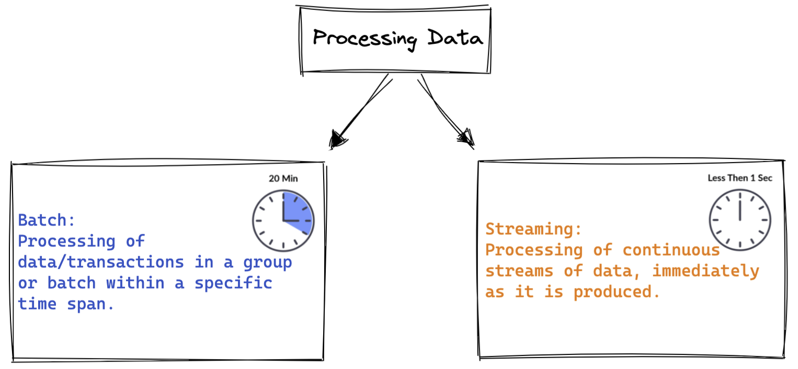
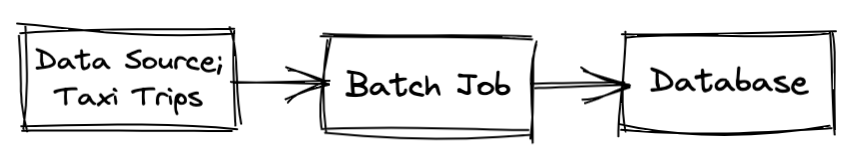
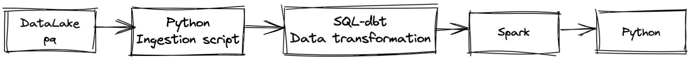
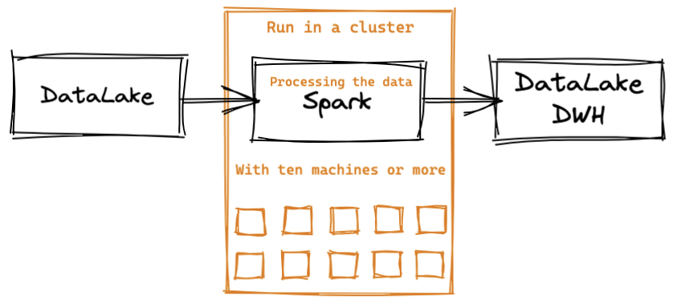
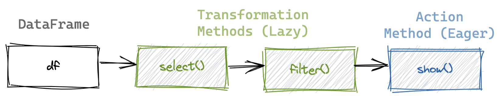
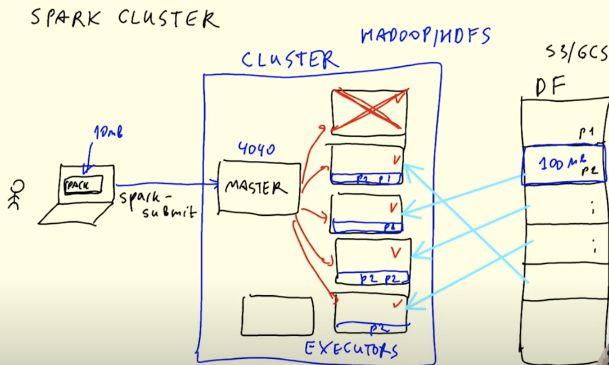
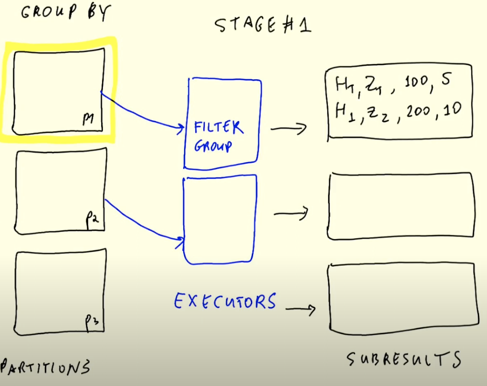

# Week 5 - Course Notes

This week's course will discuss batch data processing, you can find the course repo  <a href="https://github.com/DataTalksClub/data-engineering-zoomcamp/tree/main/week_5_batch_processing" target="_blank">here</a> and the accompanying course videos  <a href="https://www.youtube.com/watch?v=dcHe5Fl3MF8&list=PL3MmuxUbc_hJed7dXYoJw8DoCuVHhGEQb&index=48" target="_blank">here</a>.

This notes will cover:
- Introduction to batch processing.
- Spark.
  - First look at PySpark
  - Spark Dataframes
  - Spark SQL
  - Spark Internals

You can find the solution for the homework <a href="https://github.com/Balurc/data_eng_zoomcamp/blob/main/week5_batch_processing/code/homework_solutions.ipynb" target="_blank">here</a>.

## Introduction to Batch Processing

There are 2 ways to process data:

In this week's course we will discuss Batch Processing.

### Types of batch jobs

A batch job is a job or task that will process data in batches at a specified time interval.

A batch job may be run based on the following time intervals:
- Minutes
- Hourly (most common)
- Daily (most common)
- Weekly
- Etc.

Some of the popular technologies we use to run a batch job:
- Python scripts (can be run on Kubernetes, AWS batch, etc.)
- SQL
- Spark (the focus of this week's course)
- Flink
- Etc.

### Orchestrating batch jobs

Below images shows a typical workflow of a batch job and to orchestrate this workflow we use tools like Airflow.

### Advantages and disadvantages of batch jobs

Advatages:
- Easy to manage, as the are tools (the technologies mentioned above) that we can use to define all the steps in the workflow 
- Easy to retry. Since the script can be parameterized, the jobs can easily be excuted again if they fail.
- Easy to scale. The script can be run in different machines, as per our needs, which gives us the flexibility to scale up and down.

Advatages:
- Delay. Because the batch jobs and its steps are running at regular intervals, then we would need to wait sometime before the data is fully ready for downsteam use cases.

## Spark

<a href="https://spark.apache.org/" target="_blank">Apache Spark</a> is a multi-language engine for executing data engineering, data science, and machine learning on single-node machines or clusters.

Spark is a data processing engine for both batch and streaming system. It pulls data from a data lake or data warehouse, process them, and output the results back to the data lake or data warehouse or other databases. We can run it in a cluster that has ten machines or even more.

Spark is a multi-language engine. It is originally written is Scala, but there are wrappers of Spark for other programming language such Python with its wrapper PySpark. In many companies, PySpark is the preffered tool to write spark jobs.

When to use Spark?
- We use Spark for jobs/tasks that can't be executed or completed by SQL queries. This usually happens when we need to do more complex data transformation that is very difficult for SQL to handle.
- There are tools such as Hive, Presto or Athena (a AWS managed Presto) that allow you to express jobs as SQL queries.
- The recommeded approach is if we can express the data transformation in SQL, then we should go with SQL. But, if there are cases where we can't use SQL, then use Spark. We can use both tools in the workflow.

For Spark installation, you can visit <a href="https://github.com/DataTalksClub/data-engineering-zoomcamp/tree/main/week_5_batch_processing/setup" target="_blank">this guide</a>.

### First look at Spark/PySpark

To start using Spark, open your Jupyter Notebook and import PySpark library and some of its dependencies:

    import pyspark
    from pyspark.sql import SparkSession

To interact with Spark, we first need to create a Spark session, which is an entry point of a Spark application or programming with Spark.

    spark = SparkSession.builder \
        .master("local[*]") \
        .appName('test') \
        .getOrCreate()

- `SparkSession` can be used create DataFrame, register DataFrame as tables, execute SQL over tables, cache tables, and read parquet files.
- `.builder` is a class attribute to construct SparkSession instances.
- `master()` sets the Spark master URL to connect to, such as “local” to run locally. `*` means that Spark will run with as many CPU cores as possible.
- `.appName` sets a name for the application, which will be shown in the Spark web UI. If no application name is set, a randomly generated name will be used.
- `getOrCreate()` gets an existing SparkSession or, if there is no existing one, creates a new one based on the options set in this builder.

Once you create a Spark session, you can access the Spark UI by going to `localhost:4040` (If you follow the installation video correctly). The UI will the recent job that we have just created.

#### Reading CSV files

Let's read a csv file from NYC TLC Trip data (High Volume For-Hire Vehicle Trip Records for Jan 2021). You can read csv file with PySpark by:

    df = spark.read \
        .option("header", "true") \
        .csv('fhvhv_tripdata_2021-01.csv')

- `read` is a class attribute to read a file.
- `.option` contains criteria for the read method. In this case, we're specifying that the first line of the CSV file contains the column names.
- `.csv` to specify the file that we are going to read.

To view the data, you can either you `df.show()` or `df.head()`. 

You can check the `schema` with `spark.createDataFrame(df).schema`, but it suggested to use fewer records to view the schema before running this command. 

To creat a schema along with the appropriate datatypes for each column, we first neet to import `types` module. `types` contains all of the available data types for Spark dataframes.

    from pyspark.sql import types
    schema = types.StructType([...])

Next, to create a new dataframe (Spark) and include the schema, you can do as below:

    df = spark.read \
        .option("header", "true") \
        .schema(schema) \
        .csv('fhvhv_tripdata_2021-01.csv')
 
 
 
 #### Partitions & Saving data to Parquet format

Inside a Spark cluster we have a bunch of executors (computers that are doing computational tasks such as pulling data from our data lake and do some computational work).
We can split a file into multiple parts so that each executor can take care of a part and have all executors working simultaneously, which in turn will speed up the process. These splits are called partitions.

Here is how we partition the dataframe into 24 partitions:

    df = df.repartition(24)

Next, we can parqutize the partitioned dataframe with:

    df.write.parquet("destination_path")

If you want to overwrite the file add mode="overwrite", otherwise it will give you an error because Spark will not write to a non-empty folder. 

    df.write.parquet("destination_path", mode="overwrite")
    
    
### Spark dataframes

#### Action vs transformations

We can do some Pandas-like operations on a Spark dataframe, such as:

    # Return a dataframe with the selected columns
    df.select('pickup_datetime', 'dropoff_datetime', 'PULocationID', 'DOLocationID')

    # Return a dataframe with selected columns, filtered by a specific value
    df.select('pickup_datetime', 'dropoff_datetime', 'PULocationID', 'DOLocationID')\
            .filter(df.hvfhs_license_num == 'HV0003')

In Spark we call the above operation as Transformation. Transformations are lazy operations that are not executed right away. They would need Actions to return results (dataframe). Some of the operations/methods are:
- `select`
- `filter`
- `joins`
- `groupBy`
- etc

Actions are the eager operations, they are executed immediately. Computations only happen when actions are triggered. Some of the Actions' methods are:
- `show`
- `head`
- `take`
- `write`

#### Functions and UDFs

Just like with Pandas, PySpark also comes with some built it functions. To use the functions we have to first import them:

    from pyspark.sql import functions as F

Here is an example of how we use `F_to_date()` function to covert datetime variables to date. For more functions, you can visit  <a href="https://spark.apache.org/docs/latest/sql-ref-functions-builtin.html" target="_blank">here</a>.

    df \
        .withColumn('pickup_date', F.to_date(df.pickup_datetime)) \
        .withColumn('dropoff_date', F.to_date(df.dropoff_datetime)) \
        .select('pickup_date', 'dropoff_date', 'PULocationID', 'DOLocationID') \
        .show()

We can also create our own function or UDFs in PySpark. Here is an example of a function that changes a value when they are divisible by 7 or 3.

    def crazy_stuff(base_num):
        num = int(base_num[1:])
        if num % 7 == 0:
            return f's/{num:03x}'
        elif num % 3 == 0:
            return f'a/{num:03x}'
        else:
            return f'e/{num:03x}'

After we have defined our function, we need to create the UDF with `F.udf()` method and specifify the return data type for the function.

    crazy_stuff_udf = F.udf(crazy_stuff, returnType=types.StringType())

Here is an example of how we can use UDF in dataframe transformations:

    df \
        .withColumn('pickup_date', F.to_date(df.pickup_datetime)) \
        .withColumn('dropoff_date', F.to_date(df.dropoff_datetime)) \
        .withColumn('base_id', crazy_stuff_udf(df.dispatching_base_num)) \
        .select('base_id', 'pickup_date', 'dropoff_date', 'PULocationID', 'DOLocationID') \
        .show()

### Spark SQL

We can also use SQL queries in Spark. Berfore we go there, let's build a table called `df_trips_data` with the following operations:

- Rename columns with `withColumnRenamed` method. We rename `pickup_datetime` and `dropoff_datetime` column of both datasets because they dont match.

      df_green = spark.read.parquet('data/pq/green/*/*')
      df_green = df_green \
          .withColumnRenamed('lpep_pickup_datetime', 'pickup_datetime') \
          .withColumnRenamed('lpep_dropoff_datetime', 'dropoff_datetime')

      df_yellow = spark.read.parquet('data/pq/yellow/*/*')
      df_yellow = df_yellow \
          .withColumnRenamed('tpep_pickup_datetime', 'pickup_datetime') \
          .withColumnRenamed('tpep_dropoff_datetime', 'dropoff_datetime')

- Next, find the common columns between datasets.

      set(df_green.columns) & set(df_yellow.columns)

      common_colums = []

      yellow_columns = set(df_yellow.columns)

      for col in df_green.columns:
          if col in yellow_columns:
              common_colums.append(col)

- Then lets create a new column for `service_type` to indicate taxi type (yellow or green) with `F.lit` function that will add a literal or constant to a dataframe.

      df_green_sel = df_green \
          .select(common_colums) \
          .withColumn('service_type', F.lit('green'))

      df_yellow_sel = df_yellow \
          .select(common_colums) \
          .withColumn('service_type', F.lit('yellow'))

- Finally, let's combine both datasets.

      df_trips_data = df_green_sel.unionAll(df_yellow_sel)

- We can some operations (transformation & action) such as below to calculate the amount of records for each taxi type (`service_type`).

      df_trips_data.groupBy('service_type').count().show()

Now, let's start using SQL queries with Spark. But before that, we first have to register our dataframe as a table with `registerTempTable()` method. This method will create  a temporary table with the name `trips_data`.

    df_trips_data.registerTempTable('trips_data')

We can start using SQL queries, such below that counts the amount of records for each taxi type (`service_type`). We can make SQL queries with Spark with `spark.sql("SELECT * FROM ???")`.

    spark.sql("""
    SELECT
        service_type,
        count(1)
    FROM
        trips_data
    GROUP BY 
        service_type
    """).show()

Now let's replicate the query that we had in week 4 course that will calculate revenue based on revenue zone, month and service type.

    df_result = spark.sql("""
    SELECT 
        -- Reveneue grouping 
        PULocationID AS revenue_zone,
        date_trunc('month', pickup_datetime) AS revenue_month, 
        service_type, 

        -- Revenue calculation 
        SUM(fare_amount) AS revenue_monthly_fare,
        SUM(extra) AS revenue_monthly_extra,
        SUM(mta_tax) AS revenue_monthly_mta_tax,
        SUM(tip_amount) AS revenue_monthly_tip_amount,
        SUM(tolls_amount) AS revenue_monthly_tolls_amount,
        SUM(improvement_surcharge) AS revenue_monthly_improvement_surcharge,
        SUM(total_amount) AS revenue_monthly_total_amount,
        SUM(congestion_surcharge) AS revenue_monthly_congestion_surcharge,

        -- Additional calculations
        AVG(passenger_count) AS avg_montly_passenger_count,
        AVG(trip_distance) AS avg_montly_trip_distance
    FROM
        trips_data
    GROUP BY
        1, 2, 3
    """).show()

You can output and store the results in parquet format and to reduce the amount of files, we need to reduce the amount of partitions of the dataset, which is done with the `coalesce()` method. This will reduce the amount of partition to 1.

    df_result.coalesce(1).write.parquet('data/report/revenue/', mode='overwrite')

### Spark internals

#### Anatomy of a Spark cluster

- Spark driver is the program that submits a job to a Spark master. A driver can be operator in Airflow or can be our laptop.

- Spark master is the program that coordinates the distributions of tasks/jobs to executors. Spark master keeps track of which machines are healthy and if some machine becomes unhealthy it reassigns the work.

- Spark executors are the machines that are doing the actual computations (pull and process data).

#### GroupBy in Spark

In this section we will talk about `GROUP BY` and how Spark implements it internally. First, let's run the following operations:

    # Read green taxi dataset and rename pickup and dropoff datetime columns
    df_green = spark.read.parquet('data/pq/green/*/*')
    df_green = df_green \
        .withColumnRenamed('lpep_pickup_datetime', 'pickup_datetime') \
        .withColumnRenamed('lpep_dropoff_datetime', 'dropoff_datetime')

    # Run this query
    df_green_revenue = spark.sql("""
    SELECT 
        date_trunc('hour', pickup_datetime) AS hour, 
        PULocationID AS zone,

        SUM(total_amount) AS amount,
        COUNT(1) AS number_records
    FROM
        green
    WHERE
        pickup_datetime >= '2020-01-01 00:00:00'
    GROUP BY
        1, 2
    """).show()

In the above query we use `GROUP BY` to return total revenue and number of records per hour and zone. To arrive at the output, internally Spark will split this operation into 2 stages:

1. In the first stage, each executor groups the results in the partition and outputs the results to a temporary partition. These temporary partitions are the intermediate results.

2. In the second stage, Spark will combine all records (from intermediate results) that have the same keys, which in our example are hour and zone. This method called reshuffling as it's shuffles the records we have in each partition and move the records between different partitions. Usually we want to reshuffle as little data as possible because reshuffling is an expensive operation as we need to move a lot of data around.

In summary, `GROUP BY` in Spark happens in two stages so the first stage does group by within each partition and then the second stage we're doing a bit of reshuffling to make sure that we have the same keys within one partition and then we are reducing these records with the same key into one.

#### Joins in Spark

To demonstrate how we use `JOIN` in Spark and how it works internally, we will join `df_yellow_revenue` with `df_green_revenue`. We will join both dataframe with `outer` join, when something is in yellow dataframe but not in green dataframe we want to have zero in the green dataframe.

    # First rename some columns to identify to which service (yellow or green) the columns belong to
    df_green_revenue_tmp = df_green_revenue \
        .withColumnRenamed('amount', 'green_amount') \
        .withColumnRenamed('number_records', 'green_number_records')

    df_yellow_revenue_tmp = df_yellow_revenue \
        .withColumnRenamed('amount', 'yellow_amount') \
        .withColumnRenamed('number_records', 'yellow_number_records')

    # Join both dataframe with outer join with hour and zone as the keys
    df_join = df_green_revenue_tmp.join(df_yellow_revenue_tmp, on=['hour', 'zone'], how='outer')

As a note, the above operations are Spark transformations, and they are yet to produce any results. To get the results, we need to apply Spark actions, such as `show()`.

If we run `show()` on `df_join`, Spark will create 2 temporary dataframes (for yellow and green ) and the joint final dataframe. In this case there are 3 stages of operations:
- Stage 1: creating `df_green_revenue_tmp`
- Stage 2: creating `df_yellow_revenue_tmp`
- Stage 3: joining both dataframes and creating `df_join`

Like how it's done in `GROUP BY` (using external merge sort algorithm), Spark will shuffle the data and then reduce the records by joining green and yellow data with the matching keys (hour & zone).

### Resilient Distributed Datasets (RDD)

Dataframes that we saw so far are built on RDD. RDD is what Spark uses internally for doing distributed combinations. Most of the time we dont need to use RDD but it's recommended to know how use RDD. For more, please refer to the course <a href="https://www.youtube.com/watch?v=Bdu-xIrF3OM&list=PL3MmuxUbc_hJed7dXYoJw8DoCuVHhGEQb&index=58" target="_blank">videos</a>.

### Running Spark in the cloud

Follow the step by step instructions from the <a href="https://www.youtube.com/watch?v=Yyz293hBVcQ&list=PL3MmuxUbc_hJed7dXYoJw8DoCuVHhGEQb&index=60">videos</a> on:
- How to connect to Google Cloud Storage
- Create a local Spark cluster
- Setting up a Dataproc cluster
